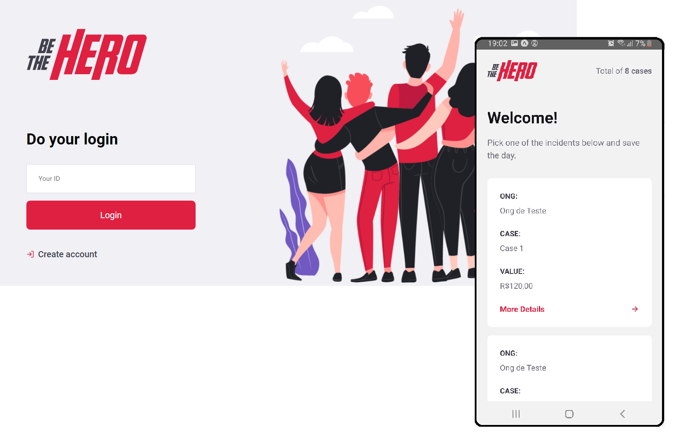

  
  
  

  Be The Hero is an app that wishes to connect people who wants to help NGO's and the institutions. The NGO's register and create their incidents using the web platform and the community uses the app to join and get in touch with the NGO's.
  

  

> This project was made for learning purposes only and comes from Rocketseat's omnistack week crash course #11. It includes technologies, such as: NodeJs, React, React Native and auxiliar libs for development and test.

# Running for the first time setup

> yarn, Node, npm required

After cloning this repo:

### Server

- Run `npm i` in the `backend` folder
- Run `npm start` to up the server

### Website

- Run `npm i` in the `frontend` folder
- Run `npm start` to up the project

### Mobile

- Run `yarn` in the `mobile` folder
- Update the `baseURL` on `src/config/index.js`
- Go back to the root folder
- Run `yarn start` to up the project

# Tests

### Server

- Run `npm test` on the `backend` folder
